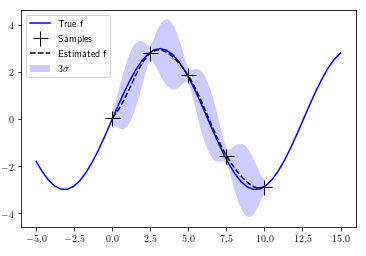

# Gaussian processes

A small notebook to practice and learn more about function modeling using gaussian processes.

Related book: [http://www.gaussianprocess.org/gpml/](http://www.gaussianprocess.org/gpml/) (Mainly chapter 2).

One example of function modeling using noisy samples.

